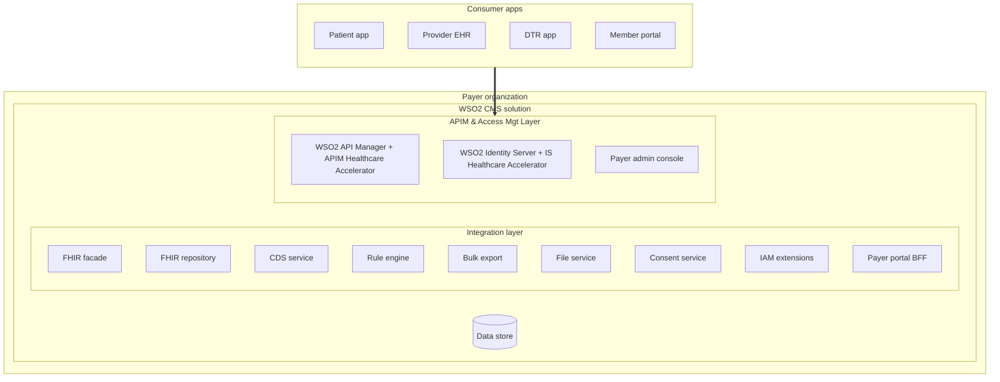
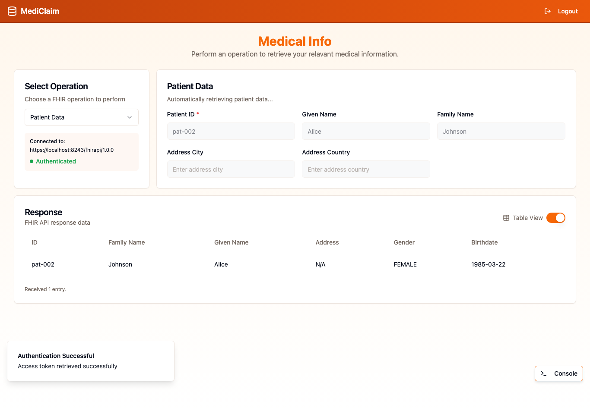
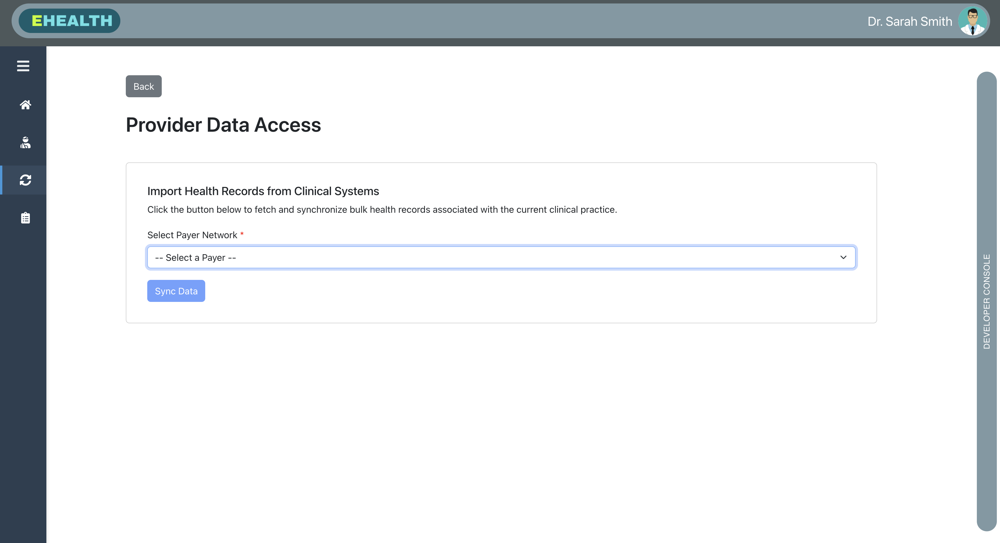
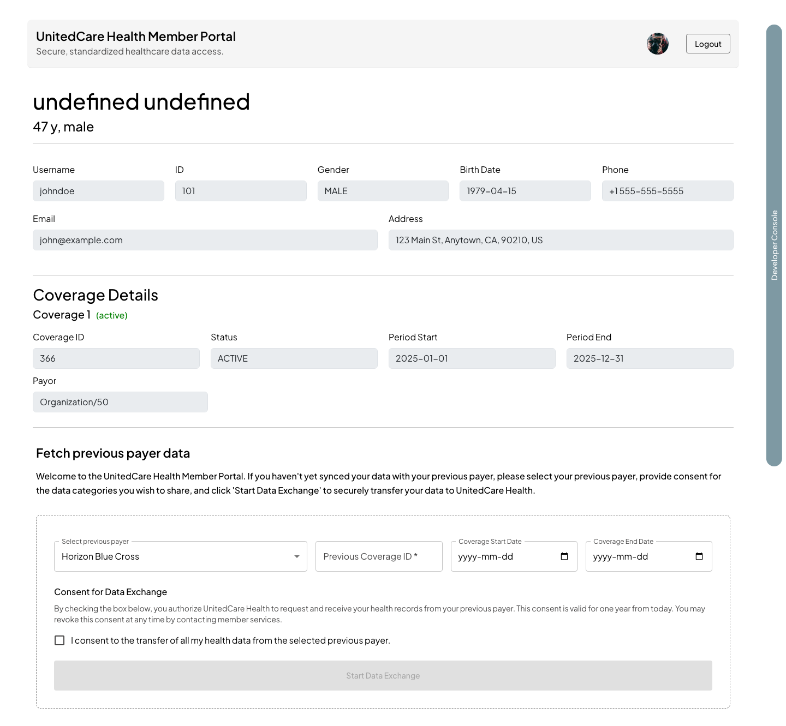
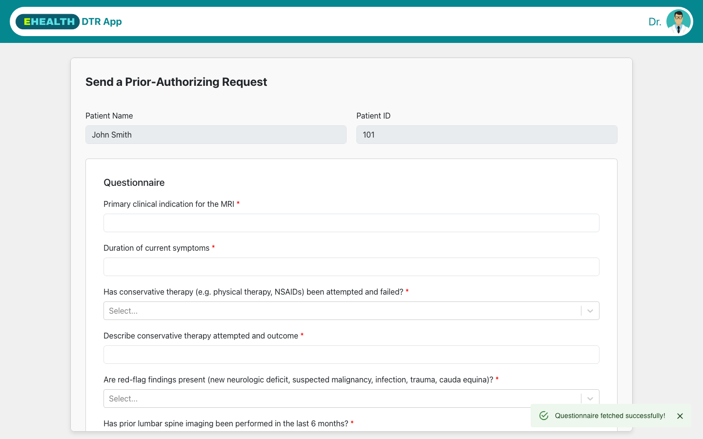
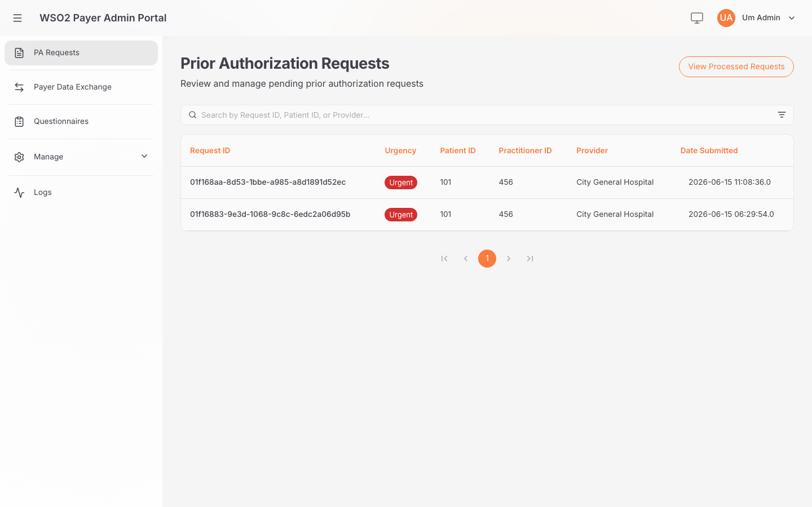
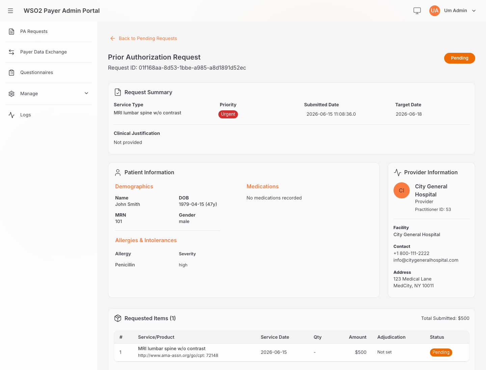

# Reference Implementation — CMS-0057-F

A complete, runnable reference implementation of the [CMS Interoperability and Prior Authorization Final Rule (CMS‑0057‑F)](https://www.cms.gov/priorities/burden-reduction/overview/interoperability/policies-and-regulations/cms-interoperability-and-prior-authorization-final-rule-cms-0057-f/cms-interoperability-and-prior-authorization-final-rule-cms-0057-f), covering **all four** regulatory provisions:

| Provision | What it does | Try it with |
| --- | --- | --- |
| **Patient Access** | Lets patients retrieve their own claims, coverage and clinical data through a SMART‑on‑FHIR app. | `demo-mediclaim-app` |
| **Provider Access** | Lets a provider/EHR retrieve a patient's data from the payer (incl. `$bulk-member-match`). | `demo-ehr-app` |
| **Payer‑to‑Payer Data Exchange** | Moves a member's history from a previous payer to a new payer (DaVinci PDex bulk export + member match). | `member-portal`, `payer-admin-app` |
| **Prior Authorization** | Automates the CRD → DTR → PAS prior‑authorization workflow (CDS Hooks, Questionnaire/DTR, Claim `$submit`). | `demo-ehr-app`, `demo-dtr-app`, `payer-admin-app` |

The **integration layer** is built with [Ballerina](https://ballerina.io/use-cases/healthcare/) (cloud‑native, FHIR‑aware). All services are securely exposed and governed through **WSO2 API Manager** + **WSO2 Identity Server**, hardened for healthcare with the **[WSO2 Open Healthcare Accelerator](https://github.com/wso2/healthcare-accelerator)**. A set of demo applications and demo backends let you exercise each flow end‑to‑end.

> This guide is written to be **followed top to bottom on a local developer machine**. Each step builds on the previous one. If you only want one provision, jump to the matching scenario in [§7 Try each CMS‑0057‑F flow](#7-try-each-cms-0057-f-flow) after completing steps 1–5.

### 🎥 Demo walkthrough

Watch the four provisions run end‑to‑end through the demo apps:

[](https://www.youtube.com/watch?v=VR9Mgo6Jv0E)

---

## Table of contents

1. [Architecture & component map](#1-architecture--component-map)
2. [Repository structure](#2-repository-structure)
3. [Prerequisites](#3-prerequisites)
4. [Step 1 — Set up the WSO2 platform (APIM + IS + Healthcare Accelerator)](#4-step-1--set-up-the-wso2-platform-apim--is--healthcare-accelerator)
5. [Step 2 — Run the integration layer & demo backends](#5-step-2--run-the-integration-layer--demo-backends)
6. [Step 3 — Expose & manage the APIs in WSO2 API Manager](#6-step-3--expose--manage-the-apis-in-wso2-api-manager)
7. [Step 4 — Run the demo applications](#7-step-4--run-the-demo-applications)
8. [Try each CMS‑0057‑F flow](#8-try-each-cms-0057-f-flow)
9. [Calling the APIs directly (tokens, curl, Postman)](#9-calling-the-apis-directly-tokens-curl-postman)
10. [Deploying to the cloud with Devant](#10-deploying-to-the-cloud-with-devant)
11. [Developer tips & troubleshooting](#11-developer-tips--troubleshooting)
12. [References](#12-references)

---

## 1. Architecture & component map


A local setup has three tiers:

1. **Platform** — WSO2 API Manager (gateway, developer/publisher portals) and WSO2 Identity Server (SMART‑on‑FHIR OAuth2/OIDC), both with the Open Healthcare Accelerator applied.
2. **Integration layer** — five Ballerina services (fhir-service, cds-service, rule-engine, bulk-export-client, file-service) that implement the CMS‑0057‑F logic.
3. **Demo backends + demo apps** — a FHIR R4 server, supporting backends, SMART helper services, and React apps that drive each flow.

### Deployment overview

Consumer apps (a patient app, a provider EHR, etc.) live **outside** the payer organization and talk to it only through the WSO2 platform. Everything else — WSO2 API Manager, WSO2 Identity Server (with the Healthcare Accelerators), and the whole integration layer — runs **inside** the payer organization.



### Default ports (local)

> Run everything on one machine and these ports must be free. Each component uses a distinct port so the full stack runs side by side without collisions.

| Component | Tier | Port(s) | Notes |
| --- | --- | --- | --- |
| WSO2 API Manager gateway | Platform | `8243` (https), `9443` (portals/token) | API traffic + dev/publisher portals |
| WSO2 Identity Server | Platform | `9453` (https) | SMART‑on‑FHIR OAuth2 / console |
| **fhir-service** | Integration | `8080` | FHIR R4 APIs, `/metadata`, `/.well-known/smart-configuration`, `$export`, `$bulk-member-match`. Connects to the FHIR repository at `9090`. |
| **cds-service** | Integration | `9096` | CDS Hooks (CRD) endpoint |
| **rule-engine** | Integration | `9097` | Coverage/PA decision logic backing the CDS service |
| **bulk-export-client** | Integration | `8091` (client), `8100` (file server) | DaVinci PDex bulk export client |
| **file-service** | Integration | `8090` | Secure file/bulk‑export file server |
| **FHIR server** (demo backend) | Backend | `9090` | [WSO2 FHIR R4 server](https://github.com/wso2/open-healthcare-prebuilt-services/tree/main/miscellaneous/fhir-server), seeded with sample data |
| **wso2_payer_portal_bff** (demo backend) | Backend | `6091` | BFF for the payer admin / member portals |
| **ehr-webhook-service** (demo backend) | Backend | `9099` | Receives PA `ClaimResponse` notifications |
| `demo-mediclaim-app` | App (demo) | `8081` | Patient Access |
| `demo-ehr-app` | App (demo) | `5175` | Provider Access + Prior Auth (mock EHR) |
| `demo-dtr-app` | App (demo) | `5174` | DTR (launched from the EHR card) |
| `member-portal` | App (demo) | `3000` | Payer‑to‑Payer |
| `payer-admin-app` | App (platform) | `5173` | Payer admin console — started by `start-services.sh`, not a demo app |
| `pas-notification-client` (optional mock) | Backend | `8095` | Alternative notification sink |

### Which components implement each provision

| Provision | Integration services | Demo backends | Demo app |
| --- | --- | --- | --- |
| Patient Access | `fhir-service` | `fhir-repository` | `demo-mediclaim-app` |
| Provider Access | `fhir-service` (incl. `$bulk-member-match`) | `fhir-repository` | `demo-ehr-app` |
| Payer‑to‑Payer | `fhir-service`, `bulk-export-client`, `file-service` | `fhir-repository`, `wso2_payer_portal_bff` | `member-portal`, `payer-admin-app` |
| Prior Authorization | `fhir-service`, `cds-service`, `rule-engine` | `fhir-repository`, `ehr-webhook-service` | `demo-ehr-app`, `demo-dtr-app`, `payer-admin-app` |

---

## 2. Repository structure

```
reference-implementation-cms0057f
├── fhir-service/             # FHIR R4 APIs, capability stmt, SMART config, $export, $bulk-member-match
├── cds-service/              # CDS Hooks (Coverage Requirements Discovery) for prior auth
├── rule-engine/              # Coverage/PA decision logic backing the CDS service
├── bulk-export-client/       # DaVinci PDex bulk export client (payer-to-payer)
├── file-service/             # Secure file / bulk-export file server
├── fhir-questionnaire-generation-pipeline/  # (Optional) AI pipeline that generates DTR Questionnaires from policy PDFs
├── apps/                     # Demo front-end applications
│   ├── demo-mediclaim-app/   #   Patient Access (SMART app)
│   ├── demo-ehr-app/         #   Provider Access + Prior Auth (mock EHR)
│   ├── demo-dtr-app/         #   Prior Auth (mock DTR / Documentation Templates & Rules)
│   ├── member-portal/        #   Payer-to-Payer (member self-service)
│   └── payer-admin-app/      #   Payer admin console (PA review + payer data exchange) — started by start-services.sh
├── demo-backends/            # Mock backends supporting the demo
│   ├── fhir-repository/       #   Seed scripts (US Core profiles + sample data) for the FHIR server
│   ├── wso2_payer_portal_bff/ #   BFF for payer-admin / member portals
│   ├── ehr-webhook-service/   #   Receives PA ClaimResponse notifications
│   └── pas-notification-client/ # Simple notification sink (optional)
└── scripts/                  # Helper scripts (run from anywhere — they cd to the repo root)
    ├── setup-platform.sh     #   Downloads APIM 4.6.0 + IS 7.3.0 + HC Accelerator 2.1.0 into ./platform (gitignored), merges & starts
    ├── start-services.sh     #   Starts the integration services + payer-admin console + deploys APIs (apictl)
    ├── stop-services.sh      #   Stops the services started by start-services.sh
    ├── setup-demo-apps.sh    #   Activates each demo app's .local config, installs, and runs them
    └── CMS-Reference-Implementation.postman_collection.json   # Postman requests for all flows (set the collection variables)
```

Each Ballerina service follows the same layout — `Ballerina.toml`, `Config.toml` (pre‑populated, edit per your environment), `service.bal`, and an `oas/` directory with the OpenAPI definition used to publish the API in WSO2 APIM.

---

## 3. Prerequisites

Install the following before you start:

| Tool | Version | Used for |
| --- | --- | --- |
| [Ballerina](https://ballerina.io/downloads/) | Swan Lake `2201.12.x` or newer | Running the integration services & Ballerina demo backends |
| [Node.js](https://nodejs.org/) + npm | `^18.18.0 \|\| >=20.0.0` | Running the React demo apps |
| [Java JDK](https://adoptium.net/) | 11 or 17 for WSO2 APIM & IS; **21+** for the FHIR server | Running WSO2 products & the mock FHIR repository |
| [apictl](https://apim.docs.wso2.com/en/latest/install-and-setup/setup/api-controller/getting-started-with-wso2-api-controller/) | matching your APIM version | Scripted API deployment (`start-services.sh`) |
| [VS Code](https://code.visualstudio.com/) + [Ballerina extension](https://ballerina.io/learn/vs-code-extension/get-started/) | latest | Recommended editor / one‑click run & deploy |
| `git`, `python3` | — | Cloning, loading FHIR sample data |

Clone this repository and open it in VS Code:

```bash
git clone https://github.com/wso2/reference-implementation-cms0057f.git
cd reference-implementation-cms0057f
code .
```


---

## 4. Step 1 — Set up the WSO2 platform (APIM + IS + Healthcare Accelerator)

The integration services are exposed and secured through WSO2 API Manager and WSO2 Identity Server, both prepared for healthcare with the **WSO2 Open Healthcare Accelerator**. Follow the official Open Healthcare docs; this section summarizes the path and the version you need.

### 4.1 Download compatible distributions

Download the base products and the **released** accelerator zips, matching versions per the compatibility table:

| Component | Version | Download |
| --- | --- | --- |
| WSO2 API Manager | **4.6.0** | https://github.com/wso2/product-apim/releases/tag/v4.6.0 |
| WSO2 Identity Server | **7.3.0** | https://github.com/wso2/product-is/releases/tag/v7.3.0 |
| Open Healthcare Accelerator (APIM + IS) | **2.1.0** | https://github.com/wso2/healthcare-accelerator/releases/tag/v2.1.0 |

> **New here? One command does it.** Run **`./scripts/setup-platform.sh`** from the repo root and it downloads the three releases above, extracts them, applies the accelerator, and starts both servers — no need to know anything about WSO2 products or where they go. 
 `./scripts/setup-platform.sh stop` stops the servers. Only the Key Manager + SMART‑on‑FHIR steps (§4.3) remain console/REST configuration.

### 4.2 Apply the accelerators

Follow the **[Manual Installation Guide](https://healthcare.docs.wso2.com/en/latest/install-and-setup/manual/)**. In short:

```bash
# API Manager
cp -r <extracted-OH-APIM-Accelerator> <WSO2_APIM_HOME>/        # call this <WSO2_OH_APIM_ACC_HOME>
cd <WSO2_OH_APIM_ACC_HOME>/bin && ./merge.sh

# Identity Server
cp -r <extracted-OH-IS-Accelerator> <WSO2_IS_HOME>/            # call this <WSO2_OH_IS_ACC_HOME>
cd <WSO2_OH_IS_ACC_HOME>/bin && ./merge.sh
```

`merge.sh` copies the healthcare OSGi components and merges `deployment.toml`. Accelerator features (FHIR `/metadata`, the `.well-known` OAuth2 discovery endpoint, SMART‑on‑FHIR, developer workflow, healthcare theme) can be toggled in `<...ACC_HOME>/conf/config.toml` before running the script.

### 4.3 Connect IS as Key Manager and configure SMART on FHIR

1. **[Configure WSO2 IS as the Key Manager for APIM](https://healthcare.docs.wso2.com/en/latest/install-and-setup/configure-km/)** (disable the resident key manager, point APIM at the IS well‑known endpoint).
2. **[Configure SMART on FHIR](https://healthcare.docs.wso2.com/en/latest/secure-health-apis/guides/configure-smart-on-fhir/)** — deploy the IS service extensions, register the pre‑issue access/ID token actions, and create the `patient` / `practitioner` / `fhirUser` user attributes and groups. Background reading: [SMART on FHIR overview](https://healthcare.docs.wso2.com/en/latest/secure-health-apis/guides/smart-on-fhir-overview/).

> **Helper services & port allocation.** The SMART‑on‑FHIR setup deploys extra Ballerina services from the accelerator's `extensions/services` — `consent-app-bff` (default `9092`), `iam-service-extensions` (default `9093`), and `smart-on-fhir-launch-service` (default `9092`). These occupy `9092`/`9093`, so this reference implementation runs **`cds-service` on `9096`** and **`rule-engine` on `9097`** to avoid the clash. If you relocate the helper services, you can move these back.

> **OAuth endpoint host.** With IS acting as Key Manager, the SMART `authorize`/`token` endpoints are served by **WSO2 Identity Server**, not APIM. If you run IS with a port offset (common when IS and APIM share a host — e.g. offset `+10` puts IS on `9453`), use that IS host:port for the `discoveryEndpoint` and `smartConfiguration` values in `fhir-service/Config.toml` and when requesting user tokens. APIM still fronts the FHIR resource APIs on the gateway (`8243`).

### 4.4 Start the servers

```bash
<WSO2_IS_HOME>/bin/wso2server.sh        # Identity Server  (https://localhost:9453)
<WSO2_APIM_HOME>/bin/api-manager.sh     # API Manager      (https://localhost:9443 portals, https://localhost:8243 gateway)
```

> **TLS trust:** the Ballerina services call APIM's discovery/token endpoints over HTTPS. Import the APIM public certificate into the truststore used by the services (see [§11 Developer tips](#11-developer-tips--troubleshooting)).

---

## 5. Step 2 — Run the integration layer & demo backends

### 5.1 Start the FHIR repository

The integration `fhir-service` reads/writes patient, claim, coverage and clinical data from a FHIR R4 store on port `9090`.

Use the [WSO2 Open Healthcare FHIR Server](https://github.com/wso2/open-healthcare-prebuilt-services/tree/main/miscellaneous/fhir-server) — a Ballerina FHIR R4 server with built-in H2 storage. Download the [prebuilt release zip](https://github.com/wso2/open-healthcare-prebuilt-services/releases/tag/fhir-server-v1.0.0) (includes `server.sh` and `ballerina_fhir_server.jar`), then start it:

```bash
curl -L -o fhir-server.zip \
  https://github.com/wso2/open-healthcare-prebuilt-services/releases/download/fhir-server-v1.0.0/fhir-server-1.0.0.zip
unzip fhir-server.zip -d fhir-server && cd fhir-server
./server.sh    # listens on http://localhost:9090 (Java 21+ required)
```

> See the upstream [FHIR server README](https://github.com/wso2/open-healthcare-prebuilt-services/blob/main/miscellaneous/fhir-server/README.md) for `Config.toml` options and for building from source with `bal run`.

Then load sample data from this repository (in a separate terminal, with the server still running):

```bash
cd demo-backends/fhir-repository
python3 load_data.py
```

Verify: `curl http://localhost:9090/fhir/r4/metadata` should return a CapabilityStatement.

### 5.2 Set up the MySQL database (required)

Three services build their database client **eagerly at startup and will not boot without a reachable MySQL database** — so this is required even for Patient/Provider Access, not just Prior Authorization:

| Service | Tables | Schema script |
| --- | --- | --- |
| `fhir-service` | `pa_requests` | `demo-backends/wso2_payer_portal_bff/scripts/init_db.sql` |
| `wso2_payer_portal_bff` | `pa_requests` (shared) | same as above |
| `bulk-export-client` | `payers`, `payer_data_exchange_requests` | `bulk-export-client/scripts/init_db.sql` |

Install MySQL 8.x, then create and seed a database (e.g. `cms0057f`):

```bash
mysql -u root -p -e "CREATE DATABASE IF NOT EXISTS cms0057f;"
mysql -u root -p cms0057f < demo-backends/wso2_payer_portal_bff/scripts/init_db.sql
mysql -u root -p cms0057f < bulk-export-client/scripts/init_db.sql
```

Then make sure the DB credentials are set in each service's config (see the table below). Note the as-shipped gaps you must fill: `fhir-service/Config.toml` has placeholder DB values, `wso2_payer_portal_bff` ships **no** `Config.toml` (you must create one with `base`, `pdexBaseUrl`, `[databaseConfig]`), and `bulk-export-client/Config.toml` has its `[databaseConfig]` block **commented out** — uncomment and fill it.

### 5.3 Configure & start the Ballerina integration services

Each service has a pre‑populated `Config.toml` (except the BFF — see §5.2). Review and update it for your environment before running — the most important keys:

| Service | Key config to review (`Config.toml`) |
| --- | --- |
| `fhir-service` | `baseUrl` (FHIR repo, default `http://localhost:9090/fhir/r4`), `serverBaseUrl`, `exportServiceUrl`, `[configs] discoveryEndpoint` and `[configs.smartConfiguration].*` (point these at your **IS** `.well-known` / authorize / token / jwks endpoints — see [§4.3](#43-connect-is-as-key-manager-and-configure-smart-on-fhir)), **`[paDatabaseConfig]` (required — MySQL, see §5.2)**, member‑match thresholds. |
| `cds-service` | `rule_engine_url` (default `http://localhost:9097`), `payer_organization_id`, the registered `cds_services`. |
| `rule-engine` | `fhir_server_url`, the `hook_id → questionnaire_id` map. |
| `bulk-export-client` | **`[databaseConfig]` (required — uncomment & fill, see §5.2)**, `[clientFhirServerConfig].baseUrl` (source FHIR server), `[clientServiceConfig].bffUrl` (`http://localhost:6091/v1`), `targetDirectory`. |
| `file-service` | `[exportServiceConfig].fhirServerBaseUrl`, `fileServerBaseUrl`, exported `types`. |

Start each service from its directory (or use the **Run** button in VS Code with the Ballerina extension):

```bash
cd fhir-service        && bal run     # :8080  (connects to FHIR repo on :9090)
cd cds-service         && bal run     # :9096
cd rule-engine         && bal run     # :9097  (needed for Prior Authorization)
cd bulk-export-client  && bal run     # :8091  + file server :8100  (needed for Payer-to-Payer)
cd file-service        && bal run     # :8090
```

> You can also start all four core services and deploy their APIs in one command — see [§6.2](#62-option-b--one-command-start--deploy-start-servicessh).

### 5.4 Start the demo backends you need

```bash
# Payer admin / member portal BFF (Payer-to-Payer, PA review)
# Requires a Config.toml with `base`, `pdexBaseUrl` and `[databaseConfig]` (see §5.2);
# it ships without one and will not start until you add it.
cd demo-backends/wso2_payer_portal_bff && bal run     # :6091

# PA notification receiver (Prior Authorization)
cd demo-backends/ehr-webhook-service   && bal run     # :9099
```

> `fhir-questionnaire-generation-pipeline/` and `demo-backends/pas-notification-client/` are **optional** — only needed if you want to generate DTR Questionnaires from policy PDFs or sink raw notifications. They are not required for the core flows.

---

## 6. Step 3 — Expose & manage the APIs in WSO2 API Manager

The Ballerina services are fronted by WSO2 APIM so they are secured with SMART‑on‑FHIR scopes and governed centrally. Each service ships its OpenAPI definition under `oas/`.

| API | OpenAPI definition | Backend endpoint | Provision(s) |
| --- | --- | --- | --- |
| FHIRServiceAPI | `fhir-service/oas/OpenAPI.yaml` | `http://localhost:8080/fhir/r4` | Patient / Provider Access, PA, P2P |
| CDSServiceAPI | `cds-service/oas/cds.yaml` | `http://localhost:9096` | Prior Authorization |
| BulkExportClientAPI | `bulk-export-client/oas/BulkExport.yaml` | `http://localhost:8091/bulk` | Payer‑to‑Payer |
| BulkExportClientFileServer | `bulk-export-client/oas/FileServer.yaml` | `http://localhost:8100/file` | Payer‑to‑Payer |
| FileServiceAPI | `file-service/oas/OpenAPI.yaml` | `http://localhost:8090` | Patient Access, Payer‑to‑Payer |

> The **FHIR API backend is the integration `fhir-service` on `:8080/fhir/r4`**, not the raw repository on `:9090` — fronting `8080` routes traffic through the CMS‑0057‑F logic (capability statement, SMART config, member match, export). The `/fhir/r4` suffix matters: the OpenAPI paths are relative (`/Patient`, `/Claim`, …), so the backend base must carry the `/fhir/r4` prefix the service serves under. Likewise the **CDS API backend is `:9096`** (the CDS service), with the rule engine on `:9097` sitting behind it. (`cds-service` uses `9096` and `rule-engine` `9097` to avoid clashing with the accelerator's SMART‑on‑FHIR consent service on `9092` and IAM service extensions on `9093` — see [§4.3](#43-connect-is-as-key-manager-and-configure-smart-on-fhir).)

> **Large OpenAPI definitions & `apictl` timeout.** The FHIR `OpenAPI.yaml` is large; `apictl`'s default 10s HTTP timeout can abort the import with `context deadline exceeded`. Raise it first: `apictl set --http-request-timeout 180000`.

### 6.1 Option A — Publish each API from its OpenAPI definition (manual)

For each row above, follow [Create an API from an OpenAPI Definition](https://apim.docs.wso2.com/en/latest/design/create-api/create-rest-api/create-a-rest-api-from-an-openapi-definition/): import the `oas/*.yaml`, set the production/sandbox backend endpoint, and publish.

### 6.2 Option B — One‑command start & deploy (`start-services.sh`)

The helper script starts the five Ballerina integration services, starts the **payer‑admin console** (`payer-admin-app`, http://localhost:5173 — the payer's admin app, not a demo app), **and** deploys the APIs to APIM via `apictl`. A companion script stops them all:

```bash
# Run from the repository root (it reads the oas/ files relative to here)
./scripts/start-services.sh        # start the integration services + deploy/publish the APIs
./scripts/stop-services.sh         # stop them (kills the recorded PIDs and their JVMs)
./scripts/stop-services.sh --all   # also stop any other lingering 'bal run' processes
```

You'll be prompted for an apictl environment name, the APIM base URL (default `https://localhost:9443`), and admin credentials. Notes:

- **Prerequisite:** [apictl](https://apim.docs.wso2.com/en/latest/install-and-setup/setup/api-controller/getting-started-with-wso2-api-controller/) installed and on your `PATH`, **and** the [§5.2 database](#52-set-up-the-mysql-database-required) up + `Config.toml` values filled (the services read their `Config.toml` on start).
- Service startup logs are written to `services_logs/`; started PIDs (incl. the payer‑admin app) are recorded in `services_logs/service.pids` (used by `stop-services.sh`).
- The payer‑admin app needs **Node ≥ 20** (uses `nvm`'s Node 20 if the default is older); if Node ≥ 20 isn't found it's skipped with a warning and the services/APIs still start.
- The large FHIR OpenAPI import can exceed `apictl`'s default 10s timeout — raise it first with `apictl set --http-request-timeout 180000`.
- API names, contexts and backend endpoints are defined inside the script — edit them to fit your environment. The FHIR API backend must be `http://localhost:8080/fhir/r4` (the relative‑path OAS needs the `/fhir/r4` base).
- The demo backends (FHIR server, BFF, webhook) are **not** managed by this script; start them separately (see [§5.1](#51-start-the-mock-fhir-repository-demo-backend) and [§5.4](#54-start-the-demo-backends-you-need)).

---

## 7. Step 4 — Run the demo applications

The demo apps are React + Vite. Each one carries **two config layers**:

| File | Purpose |
| --- | --- |
| `vite.config.ts` + `public/config.js` | **Committed cloud defaults** — used by WSO2 Choreo/Devant (managed auth, no proxy). |
| `vite.config.ts.local` + `public/config.local.js` | **Local dev** — the Vite config adds a dev‑only `/auth/userinfo` mock + a same‑origin proxy, and `config.local.js` points at the local gateway/services. |

### 7.1 One command — `setup-demo-apps.sh`

```bash
./scripts/setup-demo-apps.sh          # activate .local configs, npm install, and start all demo apps
./scripts/setup-demo-apps.sh stop     # stop the demo apps it started
```

For each demo app it copies `vite.config.ts.local → vite.config.ts` and `config.local.js → config.js`, runs `npm install` (falling back to `--legacy-peer-deps` only on peer conflicts), and `npm run dev`. **Requires Node ≥ 20** (the apps use Vite 6/7); it will use `nvm`'s Node 20 if your default is older. Logs and PIDs go to `services_logs/`.

> Running the script **overwrites** each app's active `vite.config.ts`/`public/config.js` with the local versions, so your working tree will show those files as modified — that's the local activation. Don't commit it: the committed `vite.config.ts`/`config.js` are the cloud defaults; edits belong in the `.local` files. (`git checkout apps/*/vite.config.ts apps/*/public/config.js` restores the cloud defaults.)

| Demo app | Provision | Local URL |
| --- | --- | --- |
| `demo-mediclaim-app` | Patient Access | http://localhost:8081 |
| `demo-ehr-app` | Provider Access + Prior Auth | http://localhost:5175 |
| `demo-dtr-app` | Prior Authorization (DTR) | http://localhost:5174 (launched from the EHR card) |
| `member-portal` | Payer‑to‑Payer | http://localhost:3000 |

> **`payer-admin-app` is not a demo app** — it's the payer's admin console (PA review + payer data exchange) and is started by [`start-services.sh`](#62-option-b--one-command-start--deploy-start-servicessh) (http://localhost:5173), alongside the platform services.

> The cloud apps' `.local` Vite configs include dev‑only shims (mock `/auth/userinfo` + a proxy to the local services), so they need no managed‑auth layer or backend CORS to run in a local browser. `demo-mediclaim-app` is the exception — it uses the real SMART OAuth handshake through the gateway, so its `config.local.js` needs your OAuth app's `consumerKey`/`consumerSecret`.

---

## 8. Try each CMS‑0057‑F flow

API access uses **SMART on FHIR** authorization (OAuth2 scopes). See the [SMART scopes spec](https://build.fhir.org/ig/HL7/smart-app-launch/scopes-and-launch-context.html) and [WSO2's implementation](https://healthcare.docs.wso2.com/en/latest/secure-health-apis/guides/smart-on-fhir-overview/#how-smart-on-fhir-builds-secure-apis). Before each scenario, make sure the relevant services from the table in [§1](#which-components-implement-each-provision) are running and the APIs are published.

### 8.1 Patient Access — `demo-mediclaim-app`

A SMART app that lets a **patient** sign in and read their own `Patient`, `Coverage`, `ExplanationOfBenefit`, `ClaimResponse` and `DiagnosticReport` data.

1. Ensure `fhir-service` (`:8080`) + `fhir-repository` (`:9090`) are running and `FHIRServiceAPI` is published in APIM.
2. In APIM Dev Portal, create an application, subscribe to `FHIRServiceAPI`, and generate keys. Set the **redirect URI** to the app's URL: `http://localhost:8081/api-view`.
3. Edit `apps/demo-mediclaim-app/public/config.js`: set `baseUrl` to the gateway FHIR base (e.g. `https://localhost:8243/<fhir-context>/fhir/r4`), and `consumerKey`/`consumerSecret` to your app keys.
4. `cd apps/demo-mediclaim-app && npm install && npm run dev` (serves on `http://localhost:8081`).
5. Open the app, complete the SMART authorization flow as a patient, and browse your health data.

After **Connect → SMART login (e.g. `johndoe`) → consent**, the app shows the authenticated patient's FHIR data pulled through the gateway:



### 8.2 Provider Access — `demo-ehr-app`

A mock EHR through which a **provider** retrieves a patient's data from the payer. The payer identifies the member via `$member-match` on the `fhir-service` before releasing data.

1. Ensure `fhir-service` (`:8080`) + the FHIR server (`:9090`) are running and published.
2. Point `apps/demo-ehr-app/public/config.js` at your local gateway/facade FHIR endpoints.
3. `cd apps/demo-ehr-app && npm install && npm run dev`, then exercise the provider data‑access screens — sign in as a practitioner and select a patient.



### 8.3 Payer‑to‑Payer Data Exchange — `member-portal` + `payer-admin-app`

When a member moves to a new payer, the new payer pulls the member's history from the previous payer using DaVinci PDex bulk export + member match.

1. Start `fhir-service` (`:8080`), `bulk-export-client` (`:8091` + `:8100`), `file-service` (`:8090`), and the BFF `wso2_payer_portal_bff` (`:6091`). Publish `BulkExportClientAPI`, `BulkExportClientFileServer` and `FileServiceAPI`.
2. **Member view** — configure `apps/member-portal/public/config.js` (`organizationServiceUrl`, `oldPayerCoverageGet`, `pdexExchangeUrl`, payer↔FHIR mappings), then `cd apps/member-portal && npm install && npm run dev` (`:3000`). The member selects their previous payer and authorizes the transfer.
3. **Payer admin view** — set `apps/payer-admin-app/public/config.js` (`BFF_URL`, `PDEX_API_URL`), run `npm run dev`, and use **Payer Data Exchange** / **Manage Payers** to oversee the exchange.

The member portal shows the member's current coverage and a "Start Data Exchange" form to pull history from a previous payer:



### 8.4 Prior Authorization — `demo-ehr-app` + `demo-dtr-app` + `payer-admin-app`

The CRD → DTR → PAS workflow:

1. Start `fhir-service` (`:8080`), `cds-service` (`:9096`), `rule-engine` (`:9097`), the BFF (`:6091`), and `ehr-webhook-service` (`:9099`). Publish `FHIRServiceAPI` and `CDSServiceAPI`.
2. **CRD** — in `demo-ehr-app`, create an order (e.g. an MRI or a medication). The EHR calls the CDS service (`crd-mri-spine-order-sign` / `prescribe-medication`), which uses the rule engine to return coverage/PA requirements and (when needed) a DTR launch link.
3. **DTR** — the card's launch link opens `demo-dtr-app` with the launch params (`patientId` + `questionnaire` canonical, or `coverageId` + `medicationRequestId`). It fetches the `$questionnaire-package`, renders the questionnaire, and you complete it and submit the `QuestionnaireResponse`:

   
4. **PAS** — submit the prior‑authorization `Claim/$submit` from the EHR. The submitted request appears in `payer-admin-app` (**PA Requests**) for review/decision; the decision (`ClaimResponse`) is pushed to the EHR via `ehr-webhook-service`.

The submitted prior‑authorization request in the payer‑admin review queue (the MRI request, `Urgent`, patient 101):



Opening it shows the full request — service type **MRI lumbar spine w/o contrast (CPT 72148)**, patient, provider, and the requested item pending adjudication:



> The review queue refetches when the browser tab regains focus, so a PA submitted from the EHR shows up when you switch back to the payer‑admin tab (no manual reload needed).

> DTR Questionnaires can be authored manually or generated from payer policy PDFs with the optional `fhir-questionnaire-generation-pipeline/`.

---

## 9. Calling the APIs directly (tokens, curl, Postman)

You can exercise the published APIs without the demo apps.

### 9.1 From the APIM Developer Portal

1. Go to the Dev Portal (`https://localhost:9443/devportal`) and sign in (self‑register if needed; approvals may be required if [workflows](https://healthcare.docs.wso2.com/en/latest/advance-topics/guides/enable-workflow/) are enabled).
2. [Create an application](https://apim.docs.wso2.com/en/latest/consume/manage-application/create-application/) → [subscribe to the APIs](https://apim.docs.wso2.com/en/latest/consume/manage-subscription/subscribe-to-an-api/) → [generate keys](https://apim.docs.wso2.com/en/latest/consume/manage-application/generate-keys/generate-api-keys/) → generate an access token → **Try Out**.


### 9.2 With curl

**Application (client‑credentials) token:**

```bash
curl --location 'https://localhost:9443/oauth2/token' \
  --header 'Authorization: Basic Base64(consumer-key:consumer-secret)' \
  --header 'Content-Type: application/x-www-form-urlencoded' \
  --data-urlencode 'grant_type=client_credentials'
```

**User (authorization‑code) token** — first authorize, then exchange the code:

```bash
# 1. Authorize (browser) — returns ?code=...
curl --location 'https://localhost:9443/oauth2/authorize/?response_type=code&redirect_uri=<redirect_uri>&state=<state>&client_id=<client_id>&prompt=login&nonce=<nonce>&scope=<scope1>%20<scope2>'

# 2. Exchange the code for tokens
curl --location 'https://localhost:9443/oauth2/token' \
  --header 'Content-Type: application/x-www-form-urlencoded' \
  --data-urlencode 'client_id=<client_id>' \
  --data-urlencode 'grant_type=authorization_code' \
  --data-urlencode 'code=<authorization_code>' \
  --data-urlencode 'scope=openid fhirUser' \
  --data-urlencode 'redirect_uri=<redirect_uri>' \
  --data-urlencode 'client_secret=<client_secret>'
```

Use the resulting bearer token against the gateway, e.g. `curl -H 'Authorization: Bearer <token>' https://localhost:8243/<fhir-context>/fhir/r4/Patient/<id>`.

### 9.3 Postman collection

Import `scripts/CMS-Reference-Implementation.postman_collection.json` for ready‑made requests covering all flows — Patient Access (FHIR reads), Provider Access (`$member-match`), Prior Authorization (CDS `prescribe-medication`, DTR `questionnaire-package`, Claim `$submit`), Payer‑to‑Payer (bulk export), plus the SMART token/authorize calls.

The collection is **variable‑driven** — set these collection variables to your environment before running:

| Variable | Default | Purpose |
| --- | --- | --- |
| `gateway` | `localhost:8243` | APIM gateway (FHIR / CDS / bulk APIs) |
| `idp` | `localhost:9453` | WSO2 IS — SMART `authorize` / `token` |
| `fhir-api-context` / `fhir-api-version` | `fhirapi` / `1.0.0` | FHIR API context + version in the gateway path |
| `cds-api-context` / `cds-api-version` | `cdsapi` / `1.0.0` | CDS API |
| `bulkexport-api-context` … | `bulkexportclient` / `0.1.0` | Bulk export APIs |
| `client_id` / `client_secret` | _(empty)_ | your OAuth app keys (from the Dev Portal app) |
| `patientid` | `102` | a seeded demo patient |

Notes reflecting this setup:
- FHIR requests use the **relative** resource path (e.g. `…/fhirapi/1.0.0/Patient` — no `/fhir/r4`), matching the published API whose backend is `http://localhost:8080/fhir/r4`.
- `Submit: Claim` sends a **Bundle** (DaVinci PAS), the CDS hook includes a `fhirServer`, and `$member-match` carries a valid HRex Consent — the shapes the services expect.
- OAuth `authorize`/`token` go to **IS** (`{{idp}}`, `9453`), since IS is the Key Manager.

---

## 10. Deploying to the cloud with Devant

The same artifacts can be deployed to **[WSO2 Devant](https://wso2.com/devant/)** (managed iPaaS) instead of running locally.


- Open a Ballerina project in VS Code with the Ballerina extension and click **Deploy to Devant** (choose **Configure & Deploy** to set config values).
- For `file-service` and `bulk-export-client`, add a [volume mount](https://wso2.com/choreo/docs/devops-and-ci-cd/configure-storage/) for the target directory.
- Devant deploys services as managed APIs, so a separate APIM deployment step is not required.
- For auth, you can [use Asgardeo as the external IdP](https://wso2.com/choreo/docs/administer/configure-an-external-idp/configure-asgardeo-as-an-external-idp/).

See the [Devant docs](https://wso2.com/devant/docs/) to get started.

---

## 11. Developer tips & troubleshooting

**TLS / SSL errors when a Ballerina service calls APIM** (e.g. fetching the OpenID/discovery configuration). Configure the service's HTTP client to trust the APIM certificate. For example, update `getOpenidConfigurations` in `fhir-service` to use a truststore (the APIM public cert is bundled at `fhir-service/resources/truststore.p12`):

```ballerina
http:Client discoveryEpClient = check new (discoveryEndpointUrl.toString(),
    secureSocket = {
        trustStore: {
            path: "resources/truststore.p12",
            password: "changeit"
        }
    });
```

**CORS errors from a React app calling `/oauth2/token` on APIM.** Add a CORS filter to `<APIM_HOME>/repository/deployment/server/webapps/oauth2/WEB-INF/web.xml`, just before `</web-app>`:

```xml
<filter>
  <filter-name>CORS</filter-name>
  <filter-class>com.thetransactioncompany.cors.CORSFilter</filter-class>
  <init-param>
    <param-name>cors.allowOrigin</param-name>
    <param-value>*</param-value>
  </init-param>
  <init-param>
    <param-name>cors.supportedMethods</param-name>
    <param-value>GET, POST, HEAD, PUT, DELETE, OPTIONS</param-value>
  </init-param>
  <init-param>
    <param-name>cors.supportedHeaders</param-name>
    <param-value>authorization,Access-Control-Allow-Origin,Content-Type,SOAPAction,apikey</param-value>
  </init-param>
</filter>
<filter-mapping>
  <filter-name>CORS</filter-name>
  <url-pattern>*</url-pattern>
</filter-mapping>
```

**Demo app endpoints point to the cloud.** The bundled `public/config.js` defaults target the hosted Choreo/Devant demo. Replace them with your local gateway URLs and OAuth credentials before running locally.

**Run services and apps together.** Keep the relevant Ballerina services, demo backends, and the demo app running concurrently so the front end can reach its backends.

---

## 12. References

- [CMS‑0057‑F Final Rule](https://www.cms.gov/priorities/burden-reduction/overview/interoperability/policies-and-regulations/cms-interoperability-and-prior-authorization-final-rule-cms-0057-f/cms-interoperability-and-prior-authorization-final-rule-cms-0057-f)
- WSO2 Open Healthcare docs: [Manual installation](https://healthcare.docs.wso2.com/en/latest/install-and-setup/manual/) · [Configure IS as Key Manager](https://healthcare.docs.wso2.com/en/latest/install-and-setup/configure-km/) · [Configure SMART on FHIR](https://healthcare.docs.wso2.com/en/latest/secure-health-apis/guides/configure-smart-on-fhir/)
- [WSO2 Healthcare Accelerator releases](https://github.com/wso2/healthcare-accelerator/releases)
- Provision deep‑dives: [Patient Access](https://wso2.com/library/blogs/cms-interoperability-seamless-access-to-patient-data/) · [Provider Access](https://wso2.com/library/blogs/cms-interoperability-empowering-providers-with-seamless-access-to-patient-data/) · [Payer‑to‑Payer](https://wso2.com/library/blogs/cms-interoperability-seamless-continuity-of-care-for-new-members-through-payer-to-payer-exchange/) · [Prior Authorization](https://wso2.com/library/blogs/cms-interoperability-automating-prior-authorization/)
- [Ballerina for healthcare](https://ballerina.io/use-cases/healthcare/) · [WSO2 API Manager docs](https://apim.docs.wso2.com/) · [Devant](https://wso2.com/devant/docs/)
</content>
</invoke>
