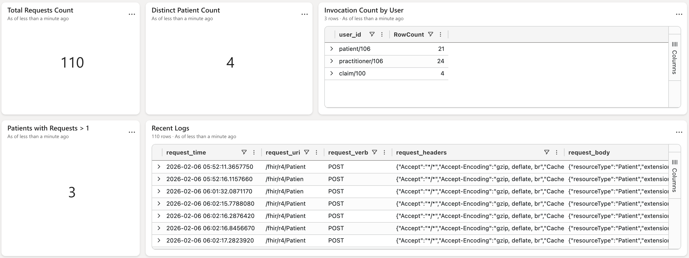

# Publishing CMS Analytics Data to Microsoft Fabric

1. Create a Microsoft Fabric account.
2. Install Fluent Bit if it is not already installed.
3. [Follow this documentation](https://learn.microsoft.com/en-us/fabric/real-time-intelligence/get-data-fluent?tabs=default%2Cclassic) to link Fluent Bit with Microsoft Fabric.
4. When following the “Create a target table” topic in the above document, use the following table schema to create the table.
* ```module-ballerinax-health.fhir.r4/fhirr4/ballerina/src/main/resources/fhirservice/resources/analytics/fabric/fabric-kql-table-schema.kql```

5. Create an ingestion mapping for the created target table using the following:
* ```module-ballerinax-health.fhir.r4/fhirr4/ballerina/src/main/resources/fhirservice/resources/analytics/fabric/kql-ingestion-mapping.txt```

6. Import the CMS dashboard template to the Fabric:
	* Go to your workspace.
	* Add a new item by clicking “+ New Item”.
	* Create a new real-time dashboard.
	* Switch to editing mode.
	* Go to “Manage” tab.
	* Click on the “Replace with file” button and upload the dashboard template provided in the following path.
		*	```module-ballerinax-health.fhir.r4/fhirr4/ballerina/src/main/resources/fhirservice/resources/analytics/fabric/fabric-cms-dashboard-template.json```

7. Use the ```module-ballerinax-health.fhir.r4/fhirr4/ballerina/src/main/resources/fhirservice/resources/analytics/fabric/fabric-fluent-bit.conf``` Fluent Bit configuration when configuring Fluent Bit in this step. Replace the relevant placeholders with required data.

	* <ABSOLUTE_PATH_TO_PARSER_FILE> - the absolute path for the ```parsers.conf``` file. This file resides in the ```module-ballerinax-health.fhir.r4/fhirr4/ballerina/src/main/resources/fhirservice/resources/analytics``` directory.
	* <ABSOLUTE_PATH_TO_LOG_FILE> - the absolute path to the log file.
	* <ABSOLUTE_PATH_TO_DB_FILE> - the absolute path to the DB file. This file will be generated by Fluent Bit when configured.
	* <MS_FABRIC_TENANT_ID> - the tenant ID that was generated in the Microsoft Entra Service Principal creation step.
	* <MS_FABRIC_CLIENT_ID> - the client ID that was generated during the service principal creation.
	* <MS_FABRIC_CLIENT_SECRET> - the client secret that was generated during the service principal creation.
	* <MS_FABRIC_INGESTION_ENDPOINT> - ingestion URI for the created database.
	* <MS_FABRIC_DATABASE_NAME> - the created database name.
	* <MS_FABRIC_TABLE_NAME> - the created database table name.
	* <MS_FABRIC_INGESTION_MAPPING_REFERENCE> - the name of the ingestion mapping that was created in step 5 above.

8. Start Fluent Bit with the “fabric-fluent-bit.conf” file inside the above directory.
9. Start the FHIR server with the analytics configuration enabled.
10. Perform FHIR API calls.
11. Check the dashboard.

# Sample Fabric Dashboard for Patient Access API Metrics

