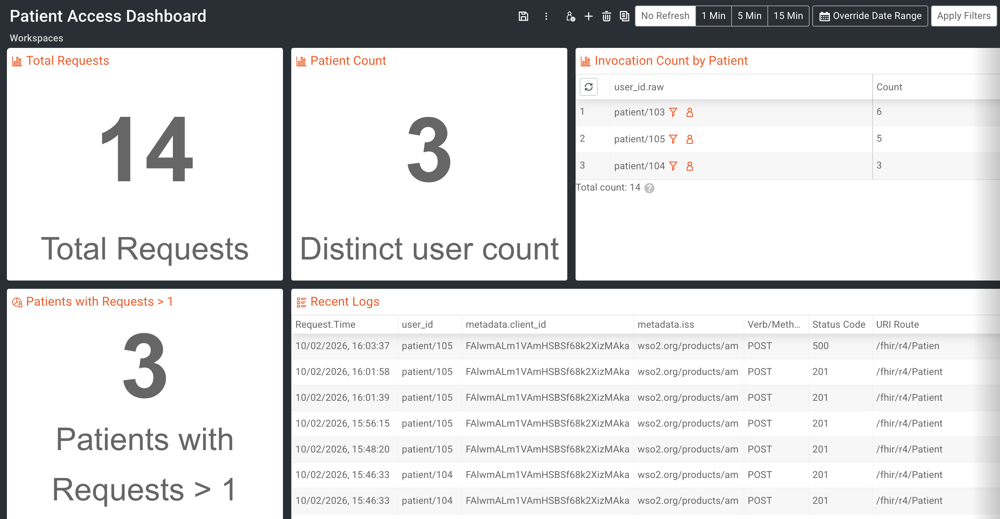

# Publishing CMS Analytics Data to Moesif

Follow the steps below to publish CMS data to the Moesif analytics platform.

1. Create a Moesif account.
2. Generate an application ID in Moesif. 
3. Import the ```module-ballerinax-health.fhir.r4/fhirr4/ballerina/src/main/resources/fhirservice/resources/analytics/moesif/moesif-cms-dashboard-template.json``` to Moesif. <Add  steps  here>
4. Install Fluent Bit if it is not already installed.
5. Go to ```module-ballerinax-health.fhir.r4/fhirr4/ballerina/src/main/resources/fhirservice/resources/analytics/moesif``` directory.
6. Replace the placeholders in the config file with the relevant data:

    * <ABSOLUTE_PATH_TO_PARSER_FILE> - the absolute path for the ```parsers.conf``` file. This file resides in the ```module-ballerinax-health.fhir.r4/fhirr4/ballerina/src/main/resources/fhirservice/resources/analytics``` directory.
    * <ABSOLUTE_PATH_TO_LOG_FILE> - the absolute path to the log file.
    * <ABSOLUTE_PATH_TO_DB_FILE> - the absolute path to the DB file. This file will be generated by Fluent Bit when configured.
    * <MOESIF_APPLICATION_ID> - the generated application ID of Moesif.

6. Start Fluent Bit with the “moesif-fluent-bit.conf” file inside the following directory.
	* ```module-ballerinax-health.fhir.r4/fhirr4/ballerina/src/main/resources/fhirservice/resources/analytics/moesif```
8. Start the FHIR server with the analytics configuration enabled.
9. Perform API calls.
10. Check the dashboard.

# Sample Moesif Dashboard for Patient Access API Metrics


