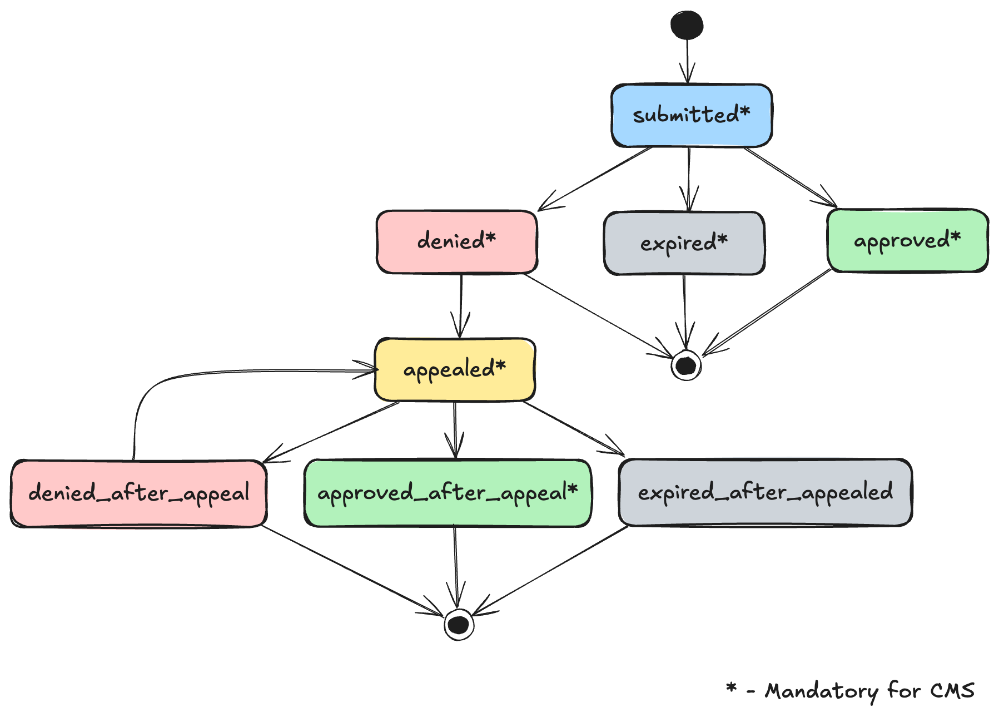
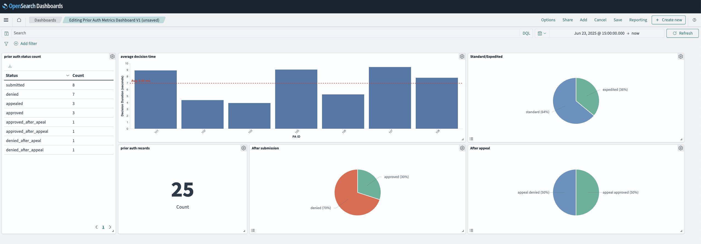

# Prior Authorization Metrics for CMS with Opensearch + Opensearch Dashboards

## Overview
As per CMS Interoperability and Prior Authorization Final Rule (CMS-0057-F),
>Impacted payers are required to report certain metrics about their prior authorization processes on their
public website on an annual basis. This includes the percent of prior authorization requests approved,
denied, and approved after appeal, and average time between submission and decision.

## Required Metrics

- Total # of prior auth requests
- % of prior authorization requests approved (first time)
- % of prior authorization requests denied
- % of prior authorization requests approved after appeal
- average time between submission and decision.

## Prior Authorization state transitions
Followng are the prior authorization state transitions required for the CMS metrics.



## Setting up  Analytics Server: Opensearch & Opensearch Dashboard

A sample docker-compose file to deploy a two node Opensearch cluster along with Opensearch Dashboard is available in `analytics_opensearch_docker_compose.yml`.

Need to provide `OPENSEARCH_INITIAL_ADMIN_PASSWORD` as an environment variable. Create a `.env` file containing the password as follows in the same path where `docker-compose.yml` exists.

```
OPENSEARCH_INITIAL_ADMIN_PASSWORD=Strong@pass@432
```

Run `docker-compose up` where the docker-compose.yml is, to download and run the OS & OSD instances.

- Default port for Opensearch: 9200
- Default port for Opensearch Dashboard: 5601

A sample Opensearch Dashboard to capture the required priro authorizaton metrics as per the spec, can be found in `prior_auth_metrics_dashboard.ndjson` which can be imported to Opensearch Dashboards as follows.

> Note: The index is set to `prior_auth_v1` in the .ndjson file. Change it if you are publishing logs under a different index.

> When the `prior_auth_metrics_dashboard.ndjson` is imported, the relevant index pattern is created along with the fields, provided in the .ndjson. Therefore make sure to have all the fields in here, since any new fields published in the log json may not be visible. (You can manually add new fields in Opensearch Dashboards if needed later.)

Visit `<open_search_dashboard_host>/app/home#/` > Manage > Saved Objects > Import

The created dashboard should be available in the Dashboards section now. The main spec required metrics can be visualized in the dashboard, and can be filtered with a given date range.

## Publishing logs to Opensearch

For each Prior Auth state transition, a log should be published with the following data points against the index (`prior_auth_v1`).
- timestamp `<string>` (ISO 8601 UTC format)
- pa_id `<string>`
- patient_id `<string>`
- pa_status `<submitted, denied, expired, appealed, approved_after_appeal, denied_after_appeal, expired_after_appeal>`
- pa_type `<standard, expedited>`
- reason_if_denied `<string>`

You can use the provided `prior_auth_metrics.postman_collection.json` postman collection to publish sample data, and visualize in the imported dashboard.

## Sample Opensearch Dashboard for Priro Authorization API Metrics

